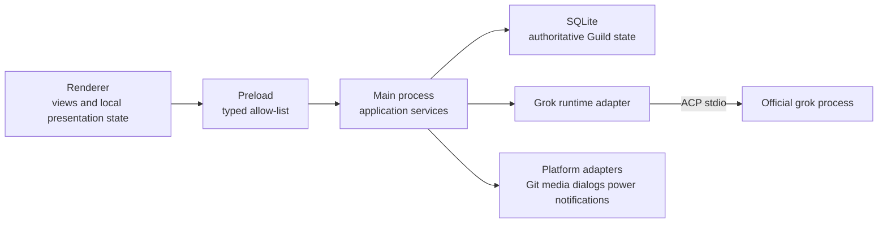

# Guild 2 architecture

## Architecture goals

- Make task/run ownership explicit and testable.
- Keep Grok behind a narrow official-process adapter.
- Keep persistence in one authoritative main-process store.
- Keep the renderer replaceable and unable to access arbitrary filesystem or process APIs.
- Prefer small modules and typed contracts over a monolithic main or renderer file.
- Preserve the accepted 1.1.13 presentation through an explicit black-box visual contract,
  while implementing every UI component and style independently.

## Selected stack for the 2.0 line

- Electron desktop shell with TypeScript in main, preload, and renderer.
- Component-based renderer with a small explicit state store.
- Main-process SQLite database for projects, tasks, messages, runs, drafts, and migrations.
- Typed IPC generated from shared schemas; deny unregistered channels.
- Official Grok ACP-over-stdio adapter as the primary agent transport.
- Packaged unit, contract, integration, and black-box acceptance tests.

This choice is driven by the no-redesign constraint, not novelty. A 2026-08-26 OS-level
process inspection of the installed 1.1.13 package showed Chromium GPU, network, and
renderer helper processes. Keeping Chromium makes the 1 px visual gate materially more
realistic than moving to WKWebView or a native UI toolkit. No bundle or renderer source
was opened for that observation.

Exact libraries and versions are not selected until dependency, license, packaging,
security, and maintenance review is complete. The choice is falsified if the Phase 0
spike shows Node cannot supervise ACP safely, Electron requires disabling sandbox/context
isolation, real lid-close recovery cannot pass even with a narrow native helper, or a
new package-size/memory requirement rules Electron out. Rust is not a default second
language; it requires measured evidence that a narrow helper solves a failed gate.

## Process boundaries



The renderer never spawns processes, reads credentials, or opens arbitrary files. Main-process
services validate every IPC request and bind it to a task, workspace, and caller window.

Process topology is a product decision, not an implementation detail. Live evidence compared
one process with concurrent sessions against isolated processes. Both completed, but the shared
process interleaved a late update from an earlier session. D-008 therefore selects one official
Grok process per active task for the first production slice. The process owns one adapter epoch;
idle teardown and later reconnect are explicit lifecycle operations, not renderer side effects.

## Domain model

- `Workspace`: canonical local folder identity and availability state.
- `Project`: user-facing grouping anchored to one workspace.
- `Task`: durable conversation identity and Grok session binding.
- `Message`: normalized user, assistant, thought, tool, permission, and media record.
- `Run`: one invocation with exact task, session, process, timestamps, and terminal outcome.
- `PermissionRequest`: one run-bound request with a single resolution.
- `UsageSnapshot`: official runtime response plus freshness and reset metadata.
- `ContinuousTask`: immutable objective plus durable work/audit phase, cycle, last owned Run,
  verified summary, remaining gaps, and explicit terminal or paused reason.

## Orthogonal state machines

The normative transition tables are in `docs/08-STATE-MACHINES.md`. Run, task/session binding,
transport/process health, and power state are separate machines. In particular:

- cancellation persists `cancel_requested` before the ACP notification and becomes `cancelled`
  only after the prompt response, confirmed process exit, or forced-kill completion;
- process death terminalizes an active Run as `interrupted`; reconnecting the session never
  revives that Run;
- sleep records the prior permission/run wait state rather than inventing a Run `suspended`
  state;
- terminal Run states are absorbing, and stale adapter-epoch events cannot mutate them.

Every transition is persisted with a reason and an idempotency key. Liveness combines OS power
events, process state, transport activity, and bounded silence; an alive process with dead stdio
is not healthy. Queueing is a Guild domain operation that creates a later Run. The UI derives
“thinking” from the authoritative Run projection and monotonic timestamps; it never owns a
free-running global timer.

Continuous execution is also a Guild domain operation, but it owns only Runs whose IDs are
durably correlated to its `ContinuousTask`. A completed work Run advances to an audit phase; only
an exact audit verdict can finish or continue the objective. User cancellation, transport loss,
desktop restart, malformed audit output, or unavailable runtime pauses or blocks the controller
without resending the last instruction. Ordinary queued turns are dispatched first. Official
`/goal` remains an independent Grok command and is never wrapped by this controller.

Process/session diagnostics are a separate bounded observability stream. Main owns a rotated,
owner-readable JSONL file under `diagnostics/runtime.jsonl`; records contain identities, lifecycle
phases, process exit evidence, recovery outcome, and tool kinds, never prompts or normal authored
output. Process stderr contributes only capped byte accounting and a presence sentinel; its content
is never stored. A transport loss
terminalizes the active Run first, then asynchronous recovery may resume the same official session.
Recovery cannot revive the Run or replay its prompt, because either could duplicate file, network,
or repository side effects.

## Runtime contract

The runtime boundary has three explicit layers:

| Layer | Owns | Must not claim |
|---|---|---|
| ACP agent transport | initialize/capabilities, advertised authentication, session new/resume/load, prompts, streamed updates, tool/permission round trips, cancel | queue, OS recovery, billing, or unadvertised account data |
| Official CLI lifecycle | documented user-operable `grok` account/runtime, diagnostics, plugin, MCP, session, memory, worktree, leader, setup, update, trace, clone, version/model and usage commands | private auth-file reads, inferred upstream HTTP, arbitrary argv, shells, gateways, relays, or headless/server transport controls |
| Guild domain | queue, durable state, liveness, sleep/wake, event routing, disclosure of gaps | invented runtime capabilities or simulated permissions |

The adapter normalizes assistant/thought/tool/media updates, bidirectional permissions,
session identifiers, terminal outcomes, and diagnostics only after capability negotiation and
successful advertised authentication. It advertises no client filesystem or terminal capability
until Guild actually implements and boundary-tests the corresponding callbacks.

Every normalized runtime envelope includes task ID, Run ID when live, Grok session ID,
`adapterEpoch`, `ingestMode=live|replay`, monotonic sequence, and receive time. `session/resume`
is preferred because it restored context without history replay in the installed runtime.
`session/load` history is staged behind the load response barrier as replay and reconciled; it
never creates a live Run or blindly appends to local history. Accepted outbound prompts carry a
durable local SHA-256 proof of text plus ordered resources. Proof, acceptance, and the optional
one-time replacement handoff share one SQLite transaction. Every replayed turn must match the prompt
plus authored text, thought, adjacent semantic order segments, ordered tools, the canonical plan
digest, and media role/type/MIME/byte SHA-256 in both directions. Every opaque tool ID is mapped into
one domain-separated SHA-256 namespace from its canonical JSON spelling for both persisted identity
and bounded order markers; raw and synthetic-looking IDs therefore cannot alias. Resource-bearing prompts and lossy tool evidence
(`rawInput`, `rawOutput`, or reduced non-text content) fail closed instead of persisting secrets or
guessing identity. Optional interrupted tails are reconciled as a full subsequence with dynamic
programming; a consumed replacement capsule and every completed turn remain mandatory. ACP v1
message IDs are optional and were absent in the live probe, so they are hints rather than correctness
keys. Multiple user notifications without a stable message ID are a fail-closed boundary ambiguity.
External root and worker session identifiers are one-way hashed before private diagnostic logging.
Unknown official worker/reviewer session updates are ordered per child session and routed to an
ephemeral activity projection only when exactly one root prompt is active. Their authored chunks
never enter root persistence, and their permission callbacks receive only a safe cancellation.
Unavailable behavior is classified `ACP-primary`, `official-CLI-fallback`, or `product-gap`.
Fallback UI must disclose reduced semantics in Chinese and English.

Administrative official-CLI operations use a second narrow main-process adapter, separate from ACP
conversation ownership. One closed action identifier maps to one literal argv template. Each action
has an exact parameter-key allowlist, bounded value parser, mutation classification, timeout, output
limit, credential redaction, and confirmation policy. The renderer receives only sanitized text,
status, and sanitized throttled progress for long-running operations. Incomplete structured output is
withheld until it can be parsed and redacted safely. It cannot name an executable,
working directory, transport URL, raw flag, or shell program.
The adapter is mutually exclusive with ACP work and queued turns, closes retained idle ACP processes
before launch, owns the detached command process group, and aborts plus joins that group during app
shutdown. Every invocation is bound to an explicitly selected task workspace; application data is
never a cwd fallback. Relative output paths and option-shaped positional values are rejected.

Conversation export applies the same latest-entry-per-`toolCallId` projection used by the active
timeline, so append-only persistence remains auditable without leaking superseded tool updates into
user-facing Markdown or JSON.

Finder-launched macOS applications do not inherit the user's shell proxy variables. Guild therefore
preserves an explicit inherited proxy when present, otherwise reads the active macOS system proxy
and passes only validated conventional proxy variables to the official Grok child. This is network
environment handoff, not a gateway: Guild never reads the Grok credential or sends the upstream
request itself.

The 2026-08-26 core probe is recorded under `evidence/runtime/` and summarized by
`docs/11-ACP-CAPABILITY-MATRIX.md`; it accepted ACP for the first production slice and selected
D-008. Real lid close, authentication expiry, malformed transport, and forced-kill escalation
remain packaged Phase 1 release gates, not implied ACP features.
No private protocol or direct credential-backed upstream request is an alternative.

Local release packaging uses a persistent, machine-local code-signing identity stored in a dedicated
user keychain. The build temporarily adds that keychain to the search list, signs every Electron code
object with one certificate, refreshes its bounded unlock timer and non-interactive `apple-tool`
partition before each package, disables online timestamping only for this self-signed local identity,
forwards SIGINT/SIGTERM to an asynchronously owned builder, restores the
prior keychain list even after an interrupted build, and verifies the outer designated
requirement contains the stable bundle identifier plus certificate root rather than a per-build
`cdhash`. This solves local update identity continuity; it is not a substitute for Developer ID and
notarization when Guild is publicly distributed.

## Persistence

- SQLite is owned by main and uses forward-only schema migrations. Rollback restores a verified
  pre-migration snapshot; it does not run unsafe down-migrations.
- Messages append atomically; run terminal state and final message commit in one transaction.
- Drafts, queued turns, permissions, and recovery checkpoints are durable.
- A permission decision is committed once with an exact outcome, cause, optional orphan cause,
  command ID, and outbox version. SQLite changes that commitment only from `NULL` to one value
  with a compare-and-set in the same transaction as the response outbox. The renderer may submit
  a typed decision command, but never an entire `PermissionRecord` snapshot.
- Large media remains file-backed with content metadata and workspace-scoped access grants.
- Old Guild data migrates only through a documented neutral export/import format. Guild 2 does
  not inspect the old application's private storage schema.
- WAL/checkpoint, corruption recovery, process death, and real sleep/wake are spike and
  Phase 1 gates, not late polish.

## UI event model

Raw runtime events are normalized before persistence. The renderer receives projections:

- continuous thought chunks coalesce under one turn disclosure;
- tool calls group without losing chronological boundaries;
- ACP session-context usage and the allowlisted official Grok prompt `_meta.totalTokens` field are
  projected as ephemeral context-window state only after exact session and adapter-epoch ownership
  checks; a missing window size stays missing and usage is never reconstructed from local text;
- late events are rejected unless task, Run where applicable, session, adapter epoch, caller,
  and ingest mode match the authoritative admission rule;
- media uses a scoped protocol with range support and explicit allowed roots;
- only the active streaming block patches at frame-bounded frequency.

## Repository target

```text
apps/desktop/             Electron entrypoints and packaging
packages/contracts/       schemas, IPC, runtime events
packages/domain/          entities and state machines
packages/runtime-grok/    official process/ACP adapter
packages/persistence/     SQLite repositories and migrations
packages/platform/        Git, media, browser opt-in, power, notifications
packages/ui/              views, components, design tokens, locales
visual-baseline/          black-box state manifest, captures, approved diff masks
tests/contract/           IPC and ACP fixtures
tests/integration/        persistence and process lifecycle
tests/acceptance/         packaged-app black-box journeys
```

## Security invariants

The complete first-commit profile is normative in `docs/09-ELECTRON-SECURITY-PROFILE.md`.

- No credential extraction for upstream calls.
- No non-loopback local server and no shared gateway.
- No arbitrary renderer filesystem access.
- No shell command construction from untrusted strings.
- Media and workspace paths are canonicalized and scoped.
- Secrets never enter logs, crash reports, fixtures, or review packages.

## Visual parity architecture

- A versioned state manifest identifies window size, locale, theme, reduced-motion setting,
  fixture data, interaction sequence, and expected capture for each reference state.
- UI fixtures drive deterministic task, thought, tool, permission, media, usage, and error
  projections without contacting Grok.
- Packaged-app capture tests compare Guild 2 against black-box 1.1.13 baselines.
- Design tokens are derived from measured visible output, not copied stylesheets.
- Every parity exception requires a product decision; framework convenience is not a reason
  to alter the accepted UI.
